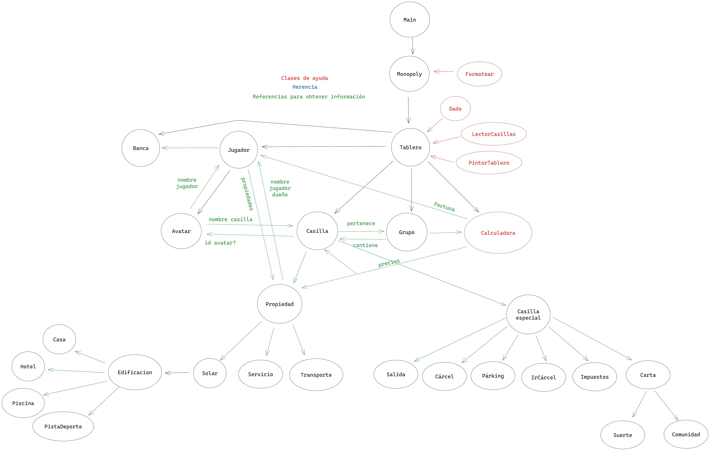

# Monopoly

Juego del Monopoly (con algunas modificaciones) para la clase de Programación
Orientada a Objetos implementado en Java.

# Comandos

## Comandos sin argumentos

- `jugador`
- `lanzar dados`
- `acabar turno`
- `salir carcel`
- `ver tablero`
- `listar { jugadores | avatares | enventa }`

## Comandos con argumentos

- `crear jugador <nombre> <tipo> [<avatar>]`
- `comprar <casilla>`
- `describir { jugador <jugador> | <casilla> }`

# Formato

La clase `utilidades.Formatear` permite formatear `String`s de diferentes formas:

- Añadir colores y estilos (método `con`)
- Limitar a un tamaño (método `celda`)
- Separar un número para indicar miles (método `num`)

Se usarán los siguientes colores para indicar resultados de comandos:

- Rojo: un error ha ocurrido
- Verde: todo ha sido exitoso
- Azul: información

# Estructura del proyecto

> Todo el código fuente se almacena en la carpeta `src`.



Definidas en el paquete `monopoly`:

- **Monopoly**: Crea el tablero y se encarga de procesar y ejecutar los
  comandos.

- **Tablero**: Crea las casillas, encargado de dibujar el tablero, contiene
  a los jugadores, etc.

- **Jugador**: Representa un jugador dentro del juego.
  - Coche
  - Esfinge
  - Sombrero
  - Pelota
  - Banca (especial)

- **Casilla** (x40): Representa una casilla del tablero y una propiedad (si aplica).
  - Solar (x22) (propiedad, pertenece a un grupo)
  - Transporte (x4) (propiedad, grupo propio)
    - Puerto
    - Aeropuerto
    - Ferrocarril
    - Nave espacial
  - Servicio (x4) (propiedad, grupo propio)
    - Telecomunicaciones
    - Eléctrico
  - Impuestos (x2)
  - Suerte (x3)
  - Comunidad (x3)
  - Especiales (x4): Carcel, Parking, Salida, IrACarcel (cada una de las esquinas)

- **Edificacion**: Modificaciones que se puede aplicar a los solares.
  - Casa
  - Hotel
  - Piscina
  - PistaDeporte

Definidas en el paquete `monopoly.utilidades`:

- **Dado**: Representa un dado, para realizar tiros y determinar cuantas
  posiciones se tiene que mover un jugador.

- **Consola**: Clase de ayuda para escribir por pantalla con colores y distintos
  formatos.

# Notas de estilo

En Java normalmente se siguen las siguientes convenciones, acorde a la [guía de
estilo de Google].

- 4 espacios de identación
- Nombres de clases: `EjemploDeNombre` (PascalCase).
- Nombres de variables (locales y atributos) y funciones: `ejemploDeNombre` (camelCase).
- Nombres de constantes: `EJEMPLO_DE_NOMBRE` (UPPER_SNAKE_CASE).
- Se prohibe el uso de `import paquete.*;`.
- Se incluyen siempre las llaves aunque solo haya una línea (las llaves van en
  la misma línea):

  ```java
  if (condicion) {
      System.out.println("Ejemplo");
  }
  ```

- Se incluyen comentarios de documentación como mínimo en los métodos públicos
  (a no ser que sean métodos super obvios y sencillos):

  ```java
  /**
   * Descripción breve del método.
   *
   * Descripción más extensa y detallada del método si fuese necesario.
   *
   * Dicha descripción puede ocupar varios párrafos.
   *
   * @param nombre Descripción de un parámetro.
   * @param nombre Descripción de otro parámetro.
   * ...
   * @return Descripción del valor devuelto.
   */

   /** Otra alternativa corta */
  ```

[guía de estilo de Google]: https://google.github.io/styleguide/javaguide.html

