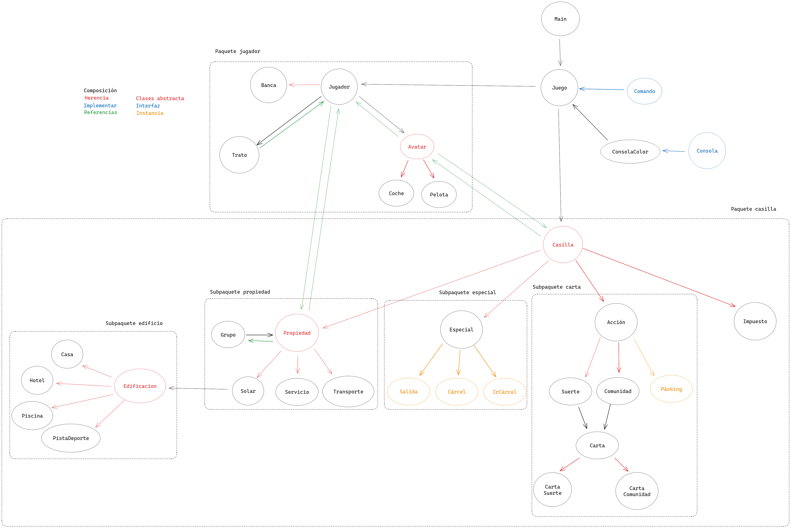

# Monopoly

Juego del Monopoly (con algunas modificaciones) para la clase de Programación
Orientada a Objetos implementado en Java.

# Compilación

Puedes usar IntelliJ Idea para compilar el proyecto.

A la hora de ejecutar, asegúrate de incluir en tu `classpath` la carpeta `src/config`.

```sh
mkdir build
javac -d build src/monopoly/**/*.java
java -cp build:src monopoly.Main
```

Y para compilar todo a un archivo _jar_:

```sh
cd build
cp -r ../src/config/ config
echo -e "Main-Class: monopoly.Main\n" > manifest.mf
jar -cfm Monopoly.jar manifest.mf config monopoly 
```

En IntelliJ:

1. `Edit Configurations` (al lado del botón de ejecutar) > `+` > `Application`.
2. En el campo de clase principal, escribe `monopoly.Main`.
3. Al lado de `Build and run`, pulsa en `Modify options` > `Java` > `Modify classpath`.
  En la nueva sección que aparezca, presiona `+` > `Include` y selecciona la carpeta
  `src/config`.

Y para crear el _jar_ con IntelliJ:

1. `File` > `Proyect Structure` > `Artifacts`.
2. Crea uno nuevo en `+` > `JAR` > `Empty`
3. Puedes darle un nombre como `Monopoly.jar` y escoger el directorio de salida, `out`.
4. Selecciona `Monopoly.jar` y abajo pulsa `Create Manifest`. Puedes seleccionar
   la carpeta de `src`. Luego, en `Main-Class`, escribe `monopoly.Main`.
5. `+` > `Module output` > `poo-monopoly` (o el nombre del proyecto) > `Ok`.
6. `+` > `Directory content` y selecciona `src/config`.
7. Abajo de todo, `Ok`.

Para finalmente compilar el _jar_, `Build` > `Build Artifacts` y selecciona el
que hemos creado. Se creará un archivo `.jar` en la carpeta que hemos
especificado.

# Estructura del proyecto

> Todo el código fuente se almacena en la carpeta `src`.




# Notas de estilo

En Java normalmente se siguen las siguientes convenciones, acorde a la [guía de
estilo de Google].

- 4 espacios de indentación
- Nombres de clases: `EjemploDeNombre` (PascalCase).
- Nombres de variables (locales y atributos) y funciones: `ejemploDeNombre` (camelCase).
- Nombres de constantes: `EJEMPLO_DE_NOMBRE` (UPPER_SNAKE_CASE).
- Se incluyen siempre las llaves aunque solo haya una línea (las llaves van en
  la misma línea):

  ```java
  if (condicion) {
      System.out.println("Ejemplo");
  }
  ```

- Se incluyen comentarios de documentación como mínimo en los métodos públicos
  (a no ser que sean métodos super obvios y sencillos):

  ```java
  /**
   * Descripción breve del método.
   *
   * Descripción más extensa y detallada del método si fuese necesario.
   *
   * Dicha descripción puede ocupar varios párrafos.
   *
   * @param nombre Descripción de un parámetro.
   * @param nombre Descripción de otro parámetro.
   * ...
   * @return Descripción del valor devuelto.
   */

   /** Otra alternativa corta */
  ```

[guía de estilo de Google]: https://google.github.io/styleguide/javaguide.html

